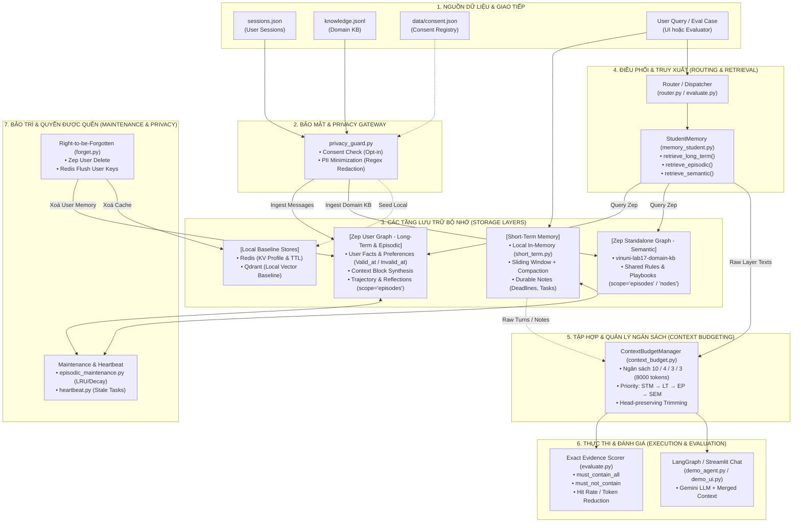
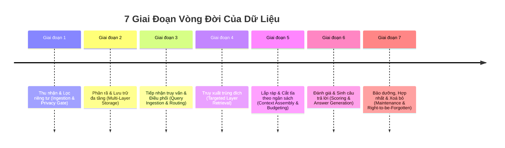
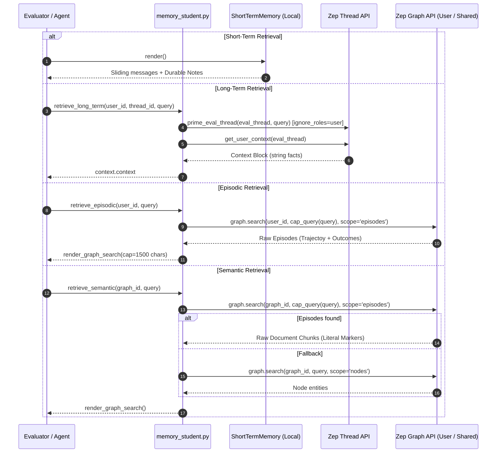

# Kiến Trúc Hệ Thống & Vòng Đời Dữ Liệu (Data Lifecycle) — Multi-Memory Agent

Tài liệu này mô tả chi tiết kiến trúc tổng thể và **vòng đời toàn diện của dữ liệu (Data Lifecycle)** khi luân chuyển qua các module trong hệ thống Multi-Memory Agent (Lab 17).

---

## 1. Sơ Đồ Kiến Trúc Tổng Thể (System Architecture)



---

## 2. 7 Giai Đoạn Trong Vòng Đời Của Dữ Liệu (The 7-Phase Data Lifecycle)



---

### Giai Đoạn 1: Thu Nhận & Lọc Quyền Riêng Tư (Ingestion & Privacy Gate)

1. **Kiểm tra Consent (Opt-in Registry):**
   - Trước khi bất kỳ message nào được đưa vào bộ nhớ dài hạn, hệ thống kiểm tra file `data/consent.json` thông qua `require_memory_consent(user_id)`.
   - Nếu user chưa đồng ý (`memory_opt_in == false`), hệ thống từ chối nạp dữ liệu bền vững.
2. **Khử PII (Personally Identifiable Information Minimization):**
   - Module `src/privacy_guard.py` áp dụng biểu thức chính quy (Regex) để tự động che dấu thông tin nhạy cảm:
     - Email: `[REDACTED_EMAIL]`
     - Số điện thoại: `[REDACTED_PHONE]`
   - Dữ liệu thô gửi lên đám mây Zep hoàn toàn sạch PII.

---

### Giai Đoạn 2: Phân Rã & Lưu Trữ Đa Tầng (Multi-Layer Storage & Indexing)

Dữ liệu được nạp vào 4 không gian bộ nhớ độc lập theo đúng phạm vi (Scope):

| Tầng Bộ Nhớ | Backend / Module | Dữ Liệu Lưu Trữ | Đặc Tính Kỹ Thuật |
| :--- | :--- | :--- | :--- |
| **Short-Term (Working)** | `src/short_term.py` (Local In-Memory) | Lịch sử phiên chat hiện tại, State tóm tắt, Durable Notes. | Nhanh, giới hạn theo cửa sổ trượt (Sliding window), tự nén (Compaction) khi vượt ngưỡng token. |
| **Long-Term (Declarative)** | **Zep Cloud User Graph** (`user_id`) | Profile, Preferences, Entities, Facts kèm nhãn thời gian (`valid_at`, `invalid_at`). | Tự động phân giải xung đột (**Recency Wins** — fact mới ghi đè fact cũ), cách ly tuyệt đối theo `user_id`. |
| **Episodic** | **Zep Cloud User Episodes** (`user_id`) | Trajectory (thử nghiệm, kết quả thành công/thất bại), Reflection về sự cố. | Lưu trữ dạng Episode thô để truy vết nguyên nhân gốc rễ (Provenance & Reflection). |
| **Semantic** | **Zep Standalone Graph** (`graph_id`) | Tri thức nghiệp vụ dùng chung, Sách hướng dẫn sự cố, Quy tắc API. | Không thuộc về cá nhân nào (`graph_id="vinuni-lab17-domain-kb"`), bảo tồn nguyên vẹn các mã quy tắc (`PAYMENT-RULE-3`). |

---

### Giai Đoạn 3: Tiếp Nhận Truy Vấn & Điều Phối (Query Ingestion & Routing)

Khi người dùng gửi một câu hỏi (hoặc Evaluator chạy qua 11 test cases):
1. **Short-Term Buffer:** Câu hỏi được thêm ngay vào danh sách tin nhắn của phiên làm việc hiện tại.
2. **Memory Router (`src/router.py`):**
   - Phân tích ngữ nghĩa câu hỏi để xác định tầng bộ nhớ mục tiêu:
     - Câu hỏi ngữ cảnh ngắn $\rightarrow$ `short_term`
     - Sở thích, thông tin cá nhân qua nhiều session $\rightarrow$ `long_term`
     - "Lần trước đã sửa lỗi thế nào?" $\rightarrow$ `episodic`
     - Quy chuẩn hệ thống, tài liệu chung $\rightarrow$ `semantic`
     - Yêu cầu phối hợp cả sở thích lẫn tài liệu $\rightarrow$ `mixed`

---

### Giai Đoạn 4: Truy Xuất Trúng Đích (Targeted Layer Retrieval)

Dữ liệu được trích xuất song song hoặc theo luồng được chỉ định thông qua 4 hàm trong `src/memory_student.py`:



---

### Giai Đoạn 5: Lắp Ráp & Cắt Tỉa Theo Ngân Sách (Context Assembly & Budgeting)

Module `src/context_budget.py` (`ContextBudgetManager`) tiếp nhận dữ liệu thô từ các tầng và đóng gói thành chuỗi Context hoàn chỉnh:

1. **Phân bổ ngân sách Token (Tổng mặc định: 8000 tokens):**
   $$\begin{aligned}
   \text{Short-Term (10\%)} &= 800 \text{ tokens} \\
   \text{Long-Term (4\%)} &= 320 \text{ tokens} \\
   \text{Episodic (3\%)} &= 240 \text{ tokens} \\
   \text{Semantic (3\%)} &= 240 \text{ tokens}
   \end{aligned}$$
2. **Thứ tự ưu tiên ghép lớp (Priority Hierarchy):**
   $$\text{SHORT\_TERM} \longrightarrow \text{LONG\_TERM} \longrightarrow \text{EPISODIC} \longrightarrow \text{SEMANTIC}$$
3. **Cắt tỉa bảo toàn phần đầu (Head-preserving Trimming):**
   - Đảm bảo các thông tin quan trọng nhất (như facts xếp hạng cao, deadline, mã quy chuẩn) không bị rớt khi vượt ngưỡng token.
4. **Đầu ra cấu trúc:**
   ```xml
   <SHORT_TERM>
   ... (Recent turns + durable notes) ...
   </SHORT_TERM>

   <LONG_TERM>
   ... (User facts & current project constraints) ...
   </LONG_TERM>

   <EPISODIC>
   ... (Past fix trajectories & reflections) ...
   </EPISODIC>

   <SEMANTIC>
   ... (Domain rules: PAYMENT-RULE-3, CONN-POOL-FIRST) ...
   </SEMANTIC>
   ```

---

### Giai Đoạn 6: Đánh Giá & Sinh Câu Trả Lời (Scoring & Answer Generation)

Dữ liệu sau khi lắp ráp được sử dụng ở 2 nhánh:

1. **Nhánh Evaluator (`src/evaluate.py`):**
   - Đánh giá trực tiếp trên chuỗi Context thu được.
   - So khớp chuỗi chính xác với Ground Truth (`must_contain_all` và `must_not_contain`).
   - Loại bỏ nguy cơ LLM ảo giác (Hallucination) hoặc đoán mò làm sai lệch điểm kiểm thử.
2. **Nhánh Trợ Lý LLM (`src/demo_agent.py` / `src/demo_ui.py`):**
   - Context được đưa vào System Prompt của mô hình ngôn ngữ (Google Gemini).
   - Mô hình tổng hợp câu trả lời chính xác, giữ đúng nhân xưng và quy định bảo mật (`control_plane/SOUL.md`).

---

### Giai Đoạn 7: Bảo Dưỡng & Quyền Được Quên (Maintenance & Right-to-be-Forgotten)

Vòng đời của dữ liệu kết thúc qua 2 cơ chế:

1. **Bảo trì & Hợp nhất định kỳ (Maintenance):**
   - `src/episodic_maintenance.py`: Áp dụng chiến lược LRU và suy giảm tầm quan trọng (Importance Decay) theo thời gian; gộp các sự cố lặp lại thành tri thức cô đọng.
   - `src/heartbeat.py`: Quét nền để dọn dẹp các task đã hoàn thành (Stale Tasks) và kiểm tra các Open Loops mà không tự ý sửa đổi trí nhớ người dùng.
2. **Quyền được quên (Right to be Forgotten — `src/forget.py`):**
   - Khi có yêu cầu xoá dữ liệu từ người dùng (`minh-lab17`):
     - Gọi `client.user.delete(user_id)` xoá toàn bộ User Graph, Threads, Episodes và Facts trên Zep Cloud.
     - Quét và xoá sạch các Redis Keys tương ứng.
     - **Giữ nguyên Standalone Semantic Graph** vì chỉ chứa tri thức chung của hệ thống, không chứa thông tin cá nhân.

---

## 3. Bảng Ma Trận Biến Đổi Dữ Liệu (Data Transformation Matrix)

| Giai đoạn | Dữ liệu đầu vào (Input) | Module xử lý | Dữ liệu đầu ra (Output) |
| :--- | :--- | :--- | :--- |
| **1. Ingest** | `sessions.json` thô | `privacy_guard.py` | JSON đã che PII (`[REDACTED_EMAIL]`) |
| **2. Storage** | Dữ liệu sạch PII | `seed.py` $\rightarrow$ Zep SDK | Node Graph, Temporal Edges, Episode Chunks |
| **3. Compaction** | 30 raw chat turns | `short_term.py` | 4 recent turns + `Durable Notes` (Deadlines, Tasks) |
| **4. Retrieval** | Query text + User/Graph ID | `memory_student.py` | Raw Layer Text (Context Block, Episodes, Nodes) |
| **5. Budgeting** | Dict 4 Layer Strings | `context_budget.py` | `Merged Context` (XML Tags) + `Token Breakdown` |
| **6. Evaluation** | Merged Context + Ground Truth | `evaluate.py` | Pass/Fail, Hit Rate, Latency, `benchmark.json` |
| **7. Erasure** | `user_id` | `forget.py` | Graph Deleted, Redis Keys = 0, `absent: True` |

---

Tài liệu này phản ánh chuẩn xác quy trình luân chuyển dữ liệu thực tế đang vận hành trong dự án.
